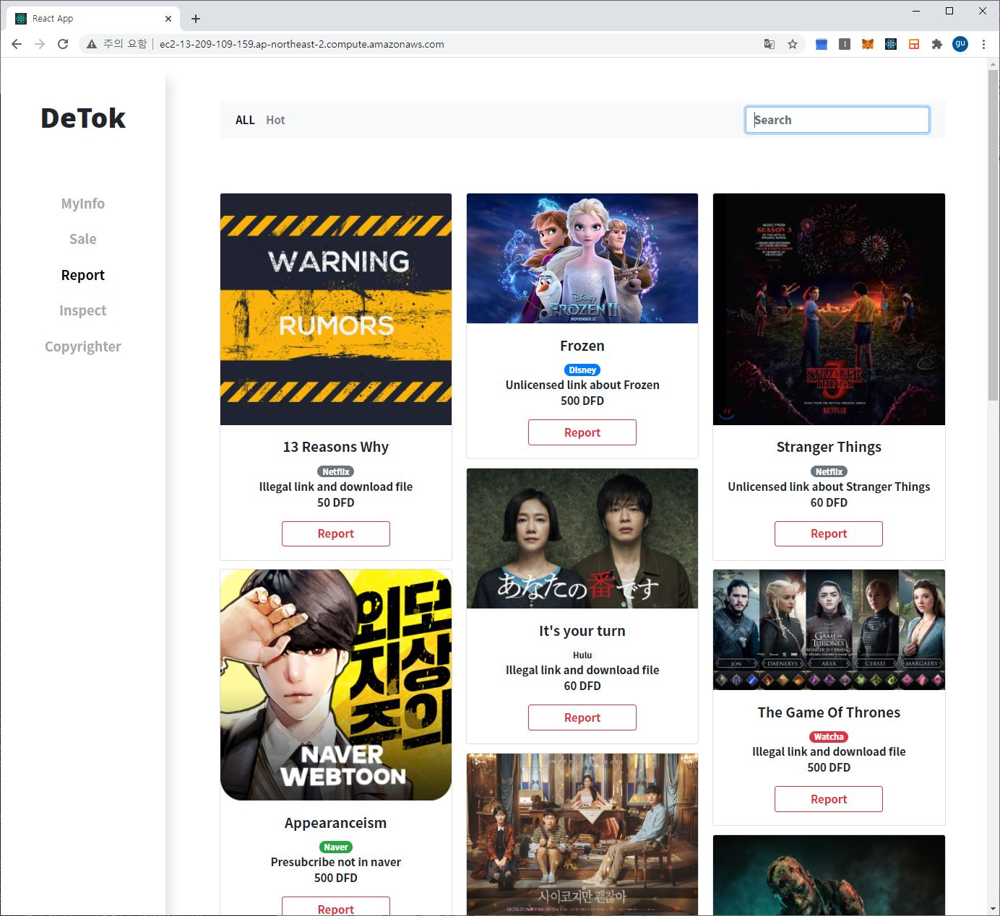
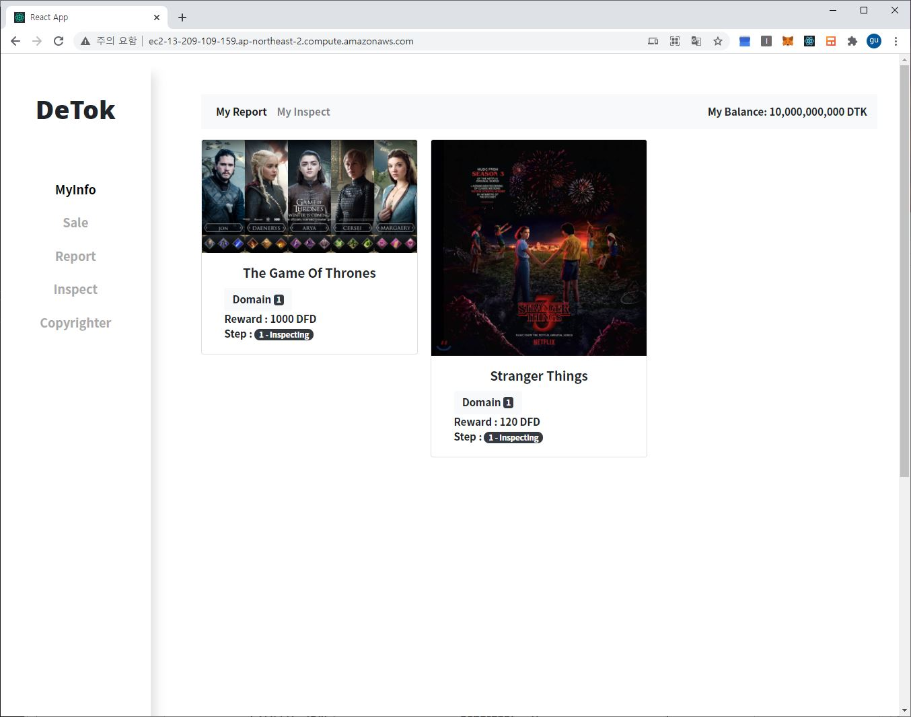
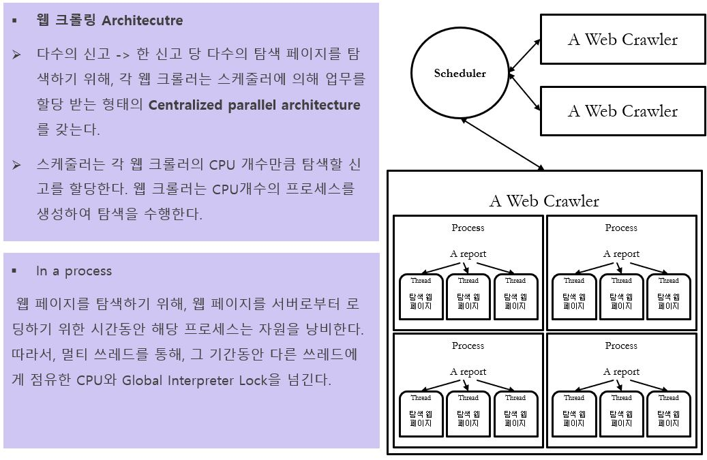

<h1 align="center">Detok

</h1>

> 주의  
컨트렉트 디렉토리의 secrets.json의 메모닉은 공유되는 메모닉입니다. 
전체 빌드를 위한 faucet을 소유하기 위한 기간이 3일 이상 소요되므로 
체험을 위해 공개됩니다.  
따라서, "절대" 해당 계정을 지갑을 복원하는 것에 사용하거나,  
실제 거래를 위해 사용해서는 안됩니다. 

 
웹 페이지 (Web service)

## [Detok](http://13.209.109.159/)

 Metamask를 설치하고, Ropsten 테스트 네트워크로 네트워크 변경하셔야 웹앱을 체험하실 수 있습니다.  
 자세한 안내는 웹 사이트 - Let's start를 따라가시면 됩니다.

   

Introduction
----------------

 

### 저작권자 <-> 감시단 정보거래 사이트

    저작권자와 감시단은 
    신원의 증명/
    저작권 소유의 증명/
    거래를 위한 결제 등록 

의 필요가 없습니다.

합의 알고리즘은 복잡하지만,
사용자는 복잡한 합의 알고리즘을 이해할 필요가 없습니다.

## 신고하기 (정보 판매)

## 검증하기 (정보 확인)

## 거래 상태 확인하기

[합의 알고리즘](http://13.209.109.159/)

 
 
 
블록체인을 사용한 모니터링 요원 분산 고용 시스템

기존의 모니터링팀의 운용의 한계를 넘어, 합의 프로토콜에 따른 스마트 컨트렉트를 통해 불특정, 다국가의 모니터링 요원을 작업의 단위(한 건의 단속)으로 고용하여, 멀티미디어가 다양한 국가에서 향유되는 상황에 적합한 적발 시스템을 제작합니다.

블록체인의 컨트렉트를 사용하는 이유는 다음과 같습니다.

> 1. 다국가에서의 불특정 다수의 신고의 필요성과 보상 인프라의 효율적 구축
> 2. 모니터링 요원과 저작권자(저작인접권자)의 보상체계의 비신뢰성  
> - 불법 저작물의 유통에 대한 정보를 취득한 저작권자가 보상을 주지 않는 경우를 고려하여, 합의 모델을 구축

 
자세한 내용은 아래의 문서를 참조하시기 바랍니다.
 

| 컴포넌트 | 문서 |
|---|---------|
| `Architecture` | [PPT](./doc/Architecture.pptx) |
| `Introduction` | [PDF](./doc/Introduction.pdf) |
| `SRS` | [PDF](./doc/SRS.pdf) |
 

소프트웨어는 크게 

    병렬 프로세싱을 수행하는 웹 크롤러
    사용자에게 인터페이스를 제공하는 WEB 어플리케이션
    사용성 증진을 위해 분산원장을 캐싱하는 Cache server(WAS)
    탈중앙화된 합의 프로토콜을 수행하는 스마트 컨트렉트

로 구성됩니다.

 

| 컴포넌트 | 용도 | 디렉토리 |
|---|---------|---:|
| `Web application` | 사용자가 블록체인과 통신할 수 있도록 하는 인터페이스 | `/client/client_react` |
| `API server` | 사용자에게 좋은 사용성과 시각적인 이미지 등을 위한 블록체인의 cache와 같은 역할을 합니다. | `/client/client_api` |
| `Contract` | 불법 모니터링과 보상을 부여하기 위한 정보 | `/core/decentralized` |
| `Web crawler` | 한 건의 정보에 대한 자동화된 병렬 탐색 | `/work/work_machine` |

   

🏁 Quick start 
---------------

 

 

## prerequisite

    Docker
    Make
    truffle

## Start server and recovery

    make start-server
    make initdb

### Quit

    make remove

  

⛏️ Build
----------------

 

## 전체 빌드 수행

이 과정은 전사적인 모든 빌드를 수행하며, 스마트 컨트렉트를 새로 발행하기 때문에, 초기 데이터를 모두 설정하기 위한
Ropsten의 이더리움을 5 ETH 이상 필요로 하며, 30분 ~ 1시간 이상의 전체 빌드 과정이 수행됩니다.
이 과정은 테스트의 목적으로 적합하지 않습니다. 아래의 웹 인터페이스만 빌드가 테스트의 목적으로 적합합니다.

다음과 같은 과정을 수행합니다.

1. 웹 서버의 컨테이너 이미지 빌드 및 실행
2. 캐시 서버의 컨테이너 이미지 빌드 및 실행(백엔드)
3. 캐시 서버의 데이터 베이스 컨테이너 이미지 빌드 및 실행
4. Ethereum Ropsten network에 스마트 컨트렉트 deploy

위 과정은 Ropsten네트워크의 상태에 종속적이고, infura의 node에 보내는 요청이
때때로 timeout을 유발하기 때문에 여러번 시도해야 하거나, gas limit을 올려야 할 수 도 있습니다.

### 준비사항

    truffle, nodejs, docker, make가 설치되어 있어야 합니다.
    Ropsten network의 계정에 10eth이상 소지해야 합니다.
    소지한 계정의 정보와 infura의 프로젝트 id를 core/decentralized/secrets.json 에 작성해주세요
    

### 빌드 실행

    cd core/decentralized
    npm install
    cd ~/<your directory>/Detok
    make deploy-all

### 테스트 거래 수행

    make test
    make initdb

  

## 인터페이스(캐시서버, 웹 서버)만 빌드 및 실행

컨트렉트는 새로 deploy하지 않고, 인터페이스 서버들만 빌드하고 실행하는 방법입니다.
다음과 같은 과정을 수행합니다.

1. 웹, 캐시 서버, DB 컨테이너 빌드 및 실행
2. 분산원장의 기록 복원
3. 테스트 케이스 이미지 복원

프로젝트의 루트 디렉토리에서 아래의 명령어를 입력하시면 됩니다.

    make start-server
    make initdb

웹 인터페이스 제거

    make remove

웹 인터페이스를 제거합니다. 언제든 인터페이스(캐시서버, 웹 서버)만 빌드 및 실행 과정을 수행하면,
불필요한 메타데이터를 제외한 모든 기록을 복원한 서버를 개설할 수 있습니다. 

   

Component
===============

******************

Contract
--------

******************

이더리움 네트워크의 계약을 통해 저작권자와 분산된 불특정 다수의 모니터링 요원 사이의 정보 교환 및 보상 합의 프로토콜 구축
   

Web server / Cache server
--------------------------

******************

이더리움 네트워크의 컨트렉트와 상호작용하는 웹 인터페이스 
사용자의 사용성 증진을 위한 Cache server를 구축 

웹 서버는 React, Nginx를 통해 구축 
캐시 서버는 Mysql, Expressjs를 통해 구축
   

Web crawler
-------------

1. 불법 저작물은 공간 지역성을 가지고 유통됨 
-  유통하는 사이트, 블로그 등에서 집중적으로 유통 
2. 특정 공간에서 유통되는 방식이 동일 
- 각 인터넷 사업자, 사이트 별로 유통되는 형식이 유사 

위의 특성을 활용하여 병렬 탐색 알고리즘을 구현
  

## 탐색

### Jumper

신고로 취득한 정보의 주변을 탐색합니다.

1. 신고로 획득한 키워드를 포함한 링크를 신고 url(Seed)로 부터 탐색한다. 
2. 링크를 방문한다. 
3. 신고로 획득한 웹 페이지와 방문한 페이지의 태그의 LCS 유사도를 통해 검사한다. 
4. 검사한 페이지로부터 다시 키워드를 포함한 링크를 탐색한다. 
5. 2단계, 3단계, 4단계를 원하는 탐색 깊이까지 반복한다. 

  
## 탐색 위치 선정

### Analyzer

웹 사이트를 분석하여, 검색창을 찾고 Jumper에게 정보를 전달합니다.

1. 신고가 들어온 인터넷 사업자의 Input창을 탐색
2. Input 창에 키워드를 검색
3. 키워드를 포함하는 하이퍼링크를 가장 많이 발생시키는 Input창을 Jumper에게 전달

   

 

본 프로젝트는 실사용을 목적으로 하지 않지만 실제 사용됨을 가정하고 개발된 프로젝트입니다.
Detok의 거래 로직은 모두 블록체인에서 수행되기 때문에, 웹과 캐시서버, DB는 모두 사용자를 위한 인터페이스의 역할만 수행합니다. 이를 위해 모든 컴포넌트는 컨테이너로 실행되며, 서버는 데이터베이스를 블록체인과 동기화 및 복원하는 작업을 수행합니다. 
 요약하자면, 블록체인 위의 정보를 컨테이너 이미지를 통해 복원하여, 수평적 확장과 고가용이 가능한 구조를 지닙니다.

Other version

이 프로젝트는 사용성 증가를 위해, 로직의 많은 부분을 블록체인 밖으로 옮긴 탈중앙화를 낮춘 버전이 존재합니다.
해당 버전은 서버에 로직이 있기 때문에 블록체인 외부의 요소를 Stateless하게 유지할 수 없습니다.
즉, 수평적 확장과 고가용성, 데이터 베이스의 보안 등 다른 요소를 서버 외부에서 고려합니다.

프로젝트의 구현에는 다음과 같은 기술 스택과 오픈 라이브러리가 사용되었습니다.

    Jenkins를 통한 CI/CD
    Container(Docker)
    React
    Expressjs
    Mysql
    Truffle
    Ganache
    Openzepplin
    Selenium

개발을 위해 사용한 언어는 다음과 같습니다.

    Python
    Solidity
    Javascript
    Shell script
    Makefile script
    Declaritive pipeline script in jenkins
    Dockerfile script

   

✍️ Authors
--------------

 

| 개발자 | 역할 |
|---|---------|
| `서왕규` | 아키텍처 설계 및 전체 구현, 문서화 작업 |
| `김효일` | 문서화 작업 및 프론트엔드 설명 페이지 구현 |

    

